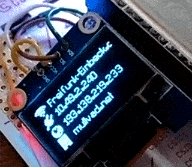

Show system informations on a small OLED display wired to the PocketCHIP.



## Hardware

Any display supported by [rm-hull/luma.oled](https://github.com/rm-hull/luma.oled).

## Dependencies

- [sysmonitor.sh by perryflynn](https://github.com/perryflynn/pocketchip-sysmonitor) as data source
- python-watchdog (Available as package on Debian) for monitoring data source file

## Usage

```
./pocketlcd.py ~/sysmonitor/monitorstatus --i2c-port 2 --all-cards
```

## Options

The script uses the `demo_opts` class of [rm-hull/luma.examples](https://github.com/rm-hull/luma.examples)
That class comes with various command line 
settings to customize the display controls.
Just start `./pocketlcd.py --help` and take a look what is possible.

I've added serval PocketLCD specific options:

```
chip@chip:~$ ~/code/pocketlcd/pocketlcd.py --help
[...]
-h, --help            show this help message and exit
--display-fps 0.20    card change speed in fps (default: 0.2)
--all-cards           display all cards (default: False)
--card-time           display the current time (default: False)
--card-battery        display the battery info (default: False)
--card-network        display the network info (default: False)
[...]
```

## Credits / Libraries / Licenses

- https://github.com/adafruit/Adafruit_Python_GPIO (MIT)
- https://github.com/rm-hull/luma.core (MIT)
- https://github.com/rm-hull/luma.oled (MIT)
- https://github.com/rm-hull/luma.examples (MIT)
- http://fontawesome.io/ (SIL OFL 1.1, MIT, CC BY 3.0)

